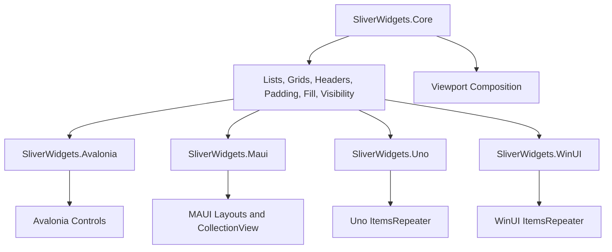

# Architecture

SliverWidgets has a strict separation between layout math and framework integration. `SliverWidgets.Core` owns constraints, geometry, visible ranges, cache ranges, and mixed viewport composition. Framework packages translate native measurement and arrangement callbacks into the core protocol.



## Core Protocol

`ISliverLayout` is the central contract:

```csharp
public interface ISliverLayout
{
    SliverLayoutResult Layout(in SliverConstraints constraints);
}
```

The input is a local sliver constraint set. The output is a `SliverGeometry` plus a list of `SliverLayoutSlot` values.

| Type | Role |
|---|---|
| `SliverConstraints` | Current scroll offset, paint range, cache range, viewport extent, cross-axis extent, growth direction, and user scroll direction. |
| `SliverGeometry` | Scroll extent, paint extent, cache extent, hit-test extent, obstruction, overflow, and visibility. |
| `SliverLayoutSlot` | Realized child index and rectangle in sliver-local main/cross-axis coordinates. |
| `SliverViewportLayoutEngine` | Composes multiple slivers into one viewport and offsets local slots into viewport coordinates. |

## Adapter Boundary

The adapters do not replace native UI frameworks. They preserve native controls, data templates, styles, focus, input, and accessibility. Their job is to:

1. Read native viewport or available-size information.
2. Build `SliverConstraints`.
3. Call a core layout.
4. Measure and arrange native controls from returned slots.
5. Release or recycle native controls outside the paint/cache window when the framework supports virtualization.

Framework packages translate native layout callbacks into this protocol.

| Package | Integration |
|---|---|
| `SliverWidgets.Avalonia` | `Panel`, `Decorator`, and `VirtualizingPanel` |
| `SliverWidgets.Maui` | `Layout`, `ILayoutManager`, and `CollectionView` |
| `SliverWidgets.Uno` | Row and grid `VirtualizingLayout` for `ItemsRepeater` |
| `SliverWidgets.WinUI` | Windows App SDK row and grid `VirtualizingLayout` |

## Axis-Neutral Layout

The core works in main-axis and cross-axis coordinates. Framework adapters map those coordinates to native rectangles:

- Vertical: main axis maps to Y/height, cross axis maps to X/width.
- Horizontal: main axis maps to X/width, cross axis maps to Y/height.

This keeps core algorithms reusable and lets tests verify horizontal and vertical behavior with the same assertions.

## Cache Windows

Every layout uses a paint range and a cache range. Paint slots are visible now. Cache-only slots are realized just outside the viewport so fast scrolling can remain smooth.

The core marks cache-only slots with `IsCacheOnly`. Framework adapters may use that flag to deprioritize expensive work, but they should still keep the corresponding container ready when the native platform benefits from look-ahead realization.

## Platform Truths

The architecture intentionally reflects framework differences:

- Avalonia exposes enough panel and virtualizing panel hooks for custom realization.
- WinUI and Uno provide `VirtualizingLayout` for `ItemsRepeater`, which maps well to sliver list and grid delegates.
- MAUI custom `Layout` does not provide arbitrary item realization; large-data virtualization goes through `CollectionView`.
- WinUI package and sample code can compile on non-Windows hosts with PRI generation disabled, but Windows App SDK runtime behavior should be validated on Windows.
