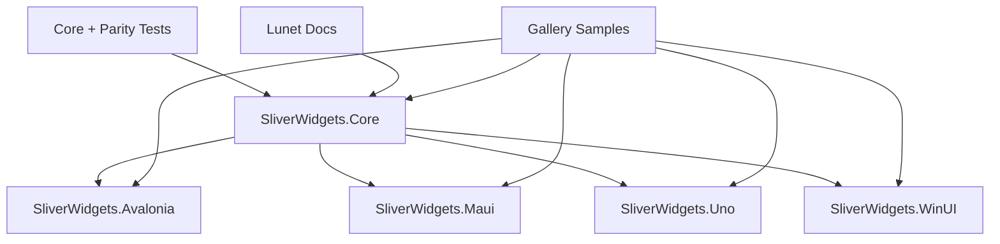

# SliverWidgets Technical Plan

## Architecture

## Package Boundaries

- `SliverWidgets.Core`: pure layout protocol, geometry, diagnostics, viewport composition.
- `SliverWidgets.Avalonia`: panels/decorators and `VirtualizingPanel` integration.
- `SliverWidgets.Maui`: `Layout` + `ILayoutManager` adapters and native-backed `CollectionView` virtualization.
- `SliverWidgets.Uno`: WinUI-compatible virtualizing layouts for `ItemsRepeater`.
- `SliverWidgets.WinUI`: Windows App SDK `VirtualizingLayout` package.

## Implemented Files

- Core:
  - `src/SliverWidgets.Core/SliverPrimitives.cs`
  - `src/SliverWidgets.Core/SliverLayouts.cs`
  - `src/SliverWidgets.Core/SliverViewportLayoutEngine.cs`
- Framework adapters:
  - `src/SliverWidgets.Avalonia/SliverStackPanel.cs`
  - `src/SliverWidgets.Avalonia/SliverGridPanel.cs`
  - `src/SliverWidgets.Avalonia/SliverPersistentHeader.cs`
  - `src/SliverWidgets.Avalonia/SliverVirtualizingStackPanel.cs`
  - `src/SliverWidgets.Avalonia/SliverVirtualizingListPanel.cs`
  - `src/SliverWidgets.Maui/SliverStackLayout.cs`
  - `src/SliverWidgets.Maui/SliverCollectionView.cs`
  - `src/SliverWidgets.Uno/SliverFixedExtentVirtualizingLayout.cs`
  - `src/SliverWidgets.Uno/SliverGridVirtualizingLayout.cs`
  - `src/SliverWidgets.WinUI/SliverFixedExtentVirtualizingLayout.cs`
  - `src/SliverWidgets.WinUI/SliverGridVirtualizingLayout.cs`
- Tests:
  - `tests/SliverWidgets.Core.Tests/SliverLayoutTests.cs`
  - `tests/SliverWidgets.FrameworkParity.Tests/FrameworkParityTests.cs`
- Samples:
  - `samples/SliverWidgets.GalleryData`
  - `samples/AvaloniaGallery`
  - `samples/MauiGallery`
  - `samples/UnoGallery`
  - `samples/UnoGalleryApp`
  - `samples/WinUIGallery`

## Framework Integration Strategy

| Framework | Implemented Track | Next Track |
|---|---|---|
| Avalonia | `Panel`, `Decorator`, fixed-extent `VirtualizingPanel`, variable-extent `VirtualizingPanel` | effective viewport/scroll owner integration |
| WinUI | `VirtualizingLayout` for fixed rows and grids, non-Windows compile path with PRI disabled | Windows runtime/device validation |
| Uno | WinUI-style row and grid `VirtualizingLayout` | renderer-specific validation |
| MAUI | `Layout` + `ILayoutManager`, native-backed `SliverCollectionView` | device validation |

## Milestones

1. Foundation
   - Core constraints, geometry, layouts, viewport engine.
   - Unit and parity tests.
   - Package metadata.
2. Adapter MVP
   - Avalonia panel adapters.
   - Uno/WinUI fixed-extent virtualizing layout.
   - MAUI layout manager adapter.
3. Full Virtualization
   - Avalonia fixed and variable `VirtualizingPanel`.
   - WinUI/Uno grid layout.
   - MAUI native `CollectionView` realization.
4. Advanced Slivers
   - floating headers.
   - snap animation services.
   - variable extent cache/dead reckoning.
   - semantic index policy.
5. Documentation and Release
   - Lunet docs.
   - samples per framework.
   - CI/package/docs workflows.
6. Gallery Samples
   - shared deterministic large data source.
   - Avalonia desktop app.
   - MAUI gallery surface.
   - Uno `ItemsRepeater` gallery surface.
   - WinUI gallery surface with Windows runtime validation.

## Validation Matrix

| Command | Host | Status |
|---|---|---|
| `dotnet build SliverWidgets.slnx` | macOS | required |
| `dotnet test SliverWidgets.slnx` | macOS | required |
| `dotnet build src/SliverWidgets.WinUI/SliverWidgets.WinUI.csproj` | macOS/Windows | required |
| `dotnet pack SliverWidgets.slnx -c Release -o artifacts/packages` | macOS | required |
| `lunet build` in `docs/` | any with Lunet | required for docs changes |
| `dotnet build samples/SliverWidgets.GalleryData/SliverWidgets.GalleryData.csproj` | macOS | required |
| Gallery project builds | framework host | required where platform tooling is available |

## Risks

- WinUI Windows App SDK runtime behavior still requires Windows validation even though code-only builds disable PRI generation on non-Windows hosts.
- Uno renderer/platform behavior must be validated before claiming full parity.
- MAUI `ScrollView` and custom layout APIs do not provide item realization; large-data virtualization uses `CollectionView`.
- Flutter pinned/floating/snap semantics are represented by a deterministic core service; framework animation clocks still need deeper sample coverage.
