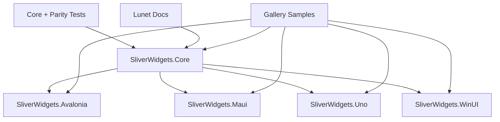

# SliverWidgets Technical Plan

## Architecture

## Package Boundaries

- `SliverWidgets.Core`: pure layout protocol, geometry, diagnostics, viewport composition.
- `SliverWidgets.Avalonia`: panels/decorators and `VirtualizingPanel` integration.
- `SliverWidgets.Maui`: `Layout` + `ILayoutManager` adapters and native-backed `CollectionView` virtualization.
- `SliverWidgets.Uno`: WinUI-compatible virtualizing layouts for `ItemsRepeater`.
- `SliverWidgets.WinUI`: Windows App SDK `VirtualizingLayout` package.

## Implemented Files

- Core:
  - `src/SliverWidgets.Core/SliverPrimitives.cs`
  - `src/SliverWidgets.Core/SliverLayouts.cs`
    - Includes `SliverWrapLayout` for variable-width/height line packing and `SliverDeterministicWrapExtentList` for deterministic large wrap feeds.
    - Includes `SliverStackLayout` for variable-width/height linear stacking and `SliverDeterministicStackExtentList` for deterministic large stack feeds.
  - `src/SliverWidgets.Core/SliverViewportLayoutEngine.cs`
    - Honors finite `ScrollOffsetCorrection` values by restarting the viewport pass from the corrected offset.
    - Honors Flutter-style `PaintOrigin`, `LayoutExtent`, `Overlap`, cache-origin correction, and per-sliver cache consumption.
- Framework adapters:
  - `src/SliverWidgets.Avalonia/SliverStackPanel.cs`
  - `src/SliverWidgets.Avalonia/SliverItemsControl.cs`
  - `src/SliverWidgets.Avalonia/SliverGridPanel.cs`
  - `src/SliverWidgets.Avalonia/SliverPersistentHeader.cs`
  - `src/SliverWidgets.Avalonia/SliverVirtualizingStackPanel.cs`
  - `src/SliverWidgets.Avalonia/SliverVirtualizingStackLayoutPanel.cs`
  - `src/SliverWidgets.Avalonia/SliverVirtualizingGridPanel.cs`
  - `src/SliverWidgets.Avalonia/SliverVirtualizingListPanel.cs`
  - `src/SliverWidgets.Avalonia/SliverVirtualizingWrapPanel.cs`
  - `src/SliverWidgets.Maui/SliverStackLayout.cs`
    - Preserves measured cross-axis size when MAUI gives an unconstrained cross-axis.
  - `src/SliverWidgets.Maui/SliverCollectionView.cs`
  - `src/SliverWidgets.Uno/SliverFixedExtentVirtualizingLayout.cs`
  - `src/SliverWidgets.Uno/SliverStackVirtualizingLayout.cs`
  - `src/SliverWidgets.Uno/SliverGridVirtualizingLayout.cs`
  - `src/SliverWidgets.Uno/SliverWrapVirtualizingLayout.cs`
  - `src/SliverWidgets.WinUI/SliverFixedExtentVirtualizingLayout.cs`
  - `src/SliverWidgets.WinUI/SliverStackVirtualizingLayout.cs`
  - `src/SliverWidgets.WinUI/SliverGridVirtualizingLayout.cs`
  - `src/SliverWidgets.WinUI/SliverWrapVirtualizingLayout.cs`
- Tests:
  - `tests/SliverWidgets.Core.Tests/SliverLayoutTests.cs`
  - `tests/SliverWidgets.FrameworkParity.Tests/FrameworkParityTests.cs`
- Samples:
  - `samples/SliverWidgets.GalleryData`
  - `samples/AvaloniaGallery`
    - Header sample maps non-pinned header desired size to visible paint extent so rows move up while the header shrinks and scrolls away.
    - `MixedSliverPreviewPanel` clips direct children to the active pinned-header obstruction when composing multiple slivers in one panel.
    - `SliverScenarioStackPanel` supports configurable stacked and push sticky section header modes. Stacked is the gallery default and clips rows only below the active leading-edge header run.
  - `samples/MauiGallery`
    - Uses the Avalonia gallery as the reference shell: top metric cards, short scenario tabs, and left controls/right native viewport per scenario.
  - `samples/UnoGallery`
    - Uses the Avalonia gallery as the reference shell: top metric cards, short scenario tabs, and left controls/right native viewport per scenario.
  - `samples/UnoGalleryApp`
  - `samples/WinUIGallery`
    - Uses the Avalonia gallery as the reference shell: top metric cards, short scenario tabs, and left controls/right native viewport per scenario.

## Framework Integration Strategy

| Framework | Implemented Track | Next Track |
|---|---|---|
| Avalonia | `Panel`, `Decorator`, logical `SliverItemsControl` host, smooth 16px logical scroll steps, non-pinned header visible extent mapping, mixed sample clipping below pinned headers, configurable section sticky-header modes without incoming-header blank bands, fixed-extent/grid/variable-extent/variable-size stack/wrap `VirtualizingPanel` | deeper platform gesture/device validation |
| WinUI | `VirtualizingLayout` for fixed rows, variable-size stacks, grids, and wrap, `VisibleRect` paint plus `RealizationRect` cache mapping, non-Windows compile path with PRI disabled | Windows runtime/device validation |
| Uno | WinUI-style row, variable-size stack, grid, and wrap `VirtualizingLayout` with `RealizationRect` visible-range inference because Uno reports `VisibleRect` as unsupported | renderer-specific validation |
| MAUI | `Layout` + `ILayoutManager` with unconstrained cross-axis measurement, native-backed `SliverCollectionView`, native variable-size stack projection, and native row-virtualized wrap projection | device validation |

## Milestones

1. Foundation
   - Core constraints, geometry, layouts, viewport engine.
   - Unit and parity tests.
   - Package metadata.
2. Adapter MVP
   - Avalonia panel adapters.
   - Uno/WinUI fixed-extent virtualizing layout.
   - MAUI layout manager adapter.
3. Full Virtualization
   - Avalonia fixed and variable `VirtualizingPanel`.
   - WinUI/Uno grid layout.
   - MAUI native `CollectionView` realization.
4. Advanced Slivers
   - floating headers.
   - snap animation services.
   - variable extent cache/dead reckoning.
   - semantic index policy.
5. Documentation and Release
   - Lunet docs.
   - samples per framework.
   - CI/package/docs workflows.
6. Gallery Samples
   - shared deterministic large data source.
   - Avalonia desktop app.
   - MAUI gallery surface matched to the Avalonia shell and scenario tab order.
   - Uno `ItemsRepeater` gallery surface matched to the Avalonia shell and scenario tab order.
   - WinUI gallery surface matched to the Avalonia shell and scenario tab order, with Windows runtime validation.
7. Flutter Parity Remediation
   - viewport `PaintOrigin`/`LayoutExtent`/cache composition.
   - pinned header, padding, fill remaining, and max-cross-axis grid parity fixes.
   - Avalonia virtualizing grid sample path.
   - adapter matrix limitations documented.
8. Variable Wrap Sliver
   - core variable-size line packing.
   - Avalonia/Uno/WinUI virtualizing adapters.
   - shared `Wrap` gallery scenario with 100,000 deterministic items.
   - MAUI native row-virtualized wrap projection with limitations documented.
9. Variable Stack Sliver
   - core variable-size linear stacking with cross-axis alignment.
   - Avalonia/Uno/WinUI virtualizing adapters.
   - shared `Stack` gallery scenario with 100,000 deterministic items.
   - MAUI native variable-size stack projection with limitations documented.

## Validation Matrix

| Command | Host | Status |
|---|---|---|
| `dotnet build SliverWidgets.slnx` | macOS | required |
| `dotnet test SliverWidgets.slnx` | macOS | required |
| `dotnet build src/SliverWidgets.WinUI/SliverWidgets.WinUI.csproj` | macOS/Windows | required |
| `dotnet pack SliverWidgets.slnx -c Release -o artifacts/packages` | macOS | required |
| `lunet build` in `docs/` | any with Lunet | required for docs changes |
| `dotnet build samples/SliverWidgets.GalleryData/SliverWidgets.GalleryData.csproj` | macOS | required |
| Gallery project builds | framework host | required where platform tooling is available |

## Risks

- WinUI Windows App SDK runtime behavior still requires Windows validation even though code-only builds disable PRI generation on non-Windows hosts.
- Uno renderer/platform behavior must be validated before claiming full parity.
- MAUI `ScrollView` and custom layout APIs do not provide item realization; large-data virtualization uses `CollectionView`.
- MAUI does not expose a portable variable-size wrap `CollectionView` layout; the gallery projects wrap lines as virtualized native rows containing variable-size chip controls.
- Flutter pinned/floating/snap semantics are represented by a deterministic core service; framework animation clocks still need deeper sample coverage.
